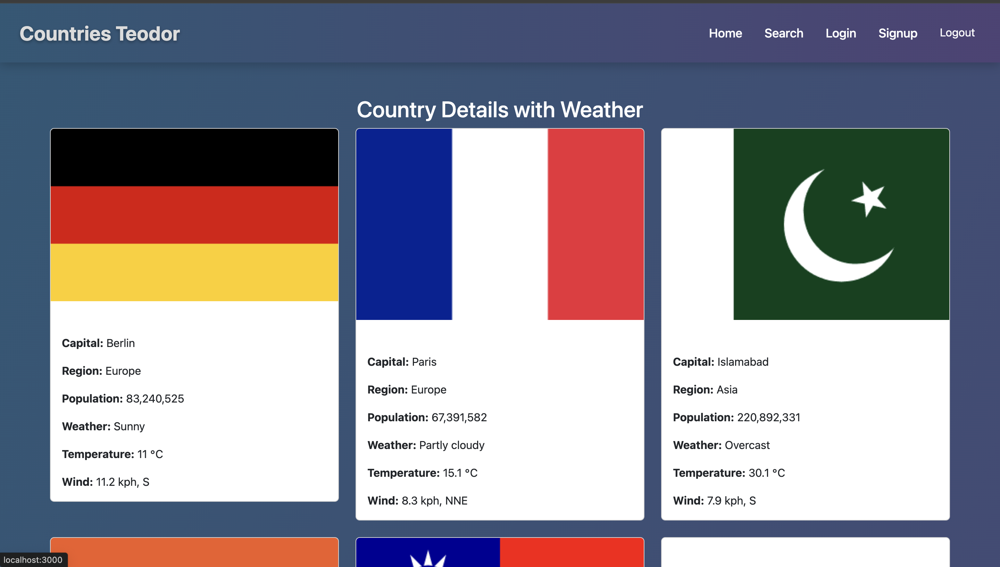
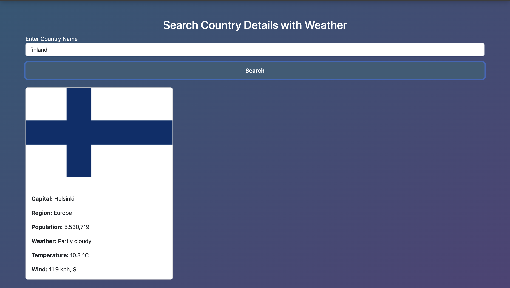

# Countries Teodor

A simple React web application that allows users to view random country details along with their weather details using APIs. The app integrates Firebase for user authentication. This application provides a user-friendly interface where users can explore country details and weather information. With a simple yet efficient design, this application is ideal for users interested in exploring different countries, their details, and weather.

## Features
- **Home Page**: Displays random country details along with their weather, offering users a quick way to see a variety of countries every time they visit the homepage. Each country is displayed with details such as capital, population, and current weather conditions.
- **Search Page**: Allows users to search for a specific country and view all related details, including the weather. Requires user login to ensure a secure and personalized experience. The search functionality helps users explore and learn more about their favorite countries in detail.
- **Authentication**: Users can sign up, log in, and log out using Firebase Authentication. The authentication feature ensures that users have a personalized experience, allowing them to securely log in and access the search functionality.
- **User-Friendly Navigation**: The app includes a responsive navigation bar, allowing users to easily switch between the Home, Search, and Login pages.

## Technologies Used
1. **React**: Core framework for building user interfaces. React is used to create a dynamic and responsive front-end, providing a smooth user experience with components that render efficiently.
2. **React Router DOM**: Handles navigation between pages (Home, Search, Login, Signup). It allows users to move seamlessly between different parts of the application without page reloads, giving a modern single-page application feel.
3. **React Redux and Redux Toolkit**: Manages the application state for country and weather data. Redux Toolkit is used to manage the global state, ensuring that the app efficiently handles data and provides a consistent experience across different components.
4. **Bootstrap**: Provides basic styling for the application, including buttons, forms, and layout. Bootstrap helps maintain a clean, professional design without the need for extensive custom CSS.
5. **Firebase Authentication**: Manages user signup, login, and logout functionalities. Firebase Authentication provides a secure and reliable way for users to authenticate and have their sessions managed, ensuring data security and user privacy.
6. **Rest Countries API**: Fetches country details such as capital, population, region, and flag. This API allows the app to dynamically display information about different countries, making it informative for users.
7. **Weather API**: Fetches the current weather details of countries, including temperature, weather conditions, wind speed, etc. This API helps display real-time weather information along with country details.

## Setup Instructions

1. **Install Dependencies**
   Install all the required dependencies using npm. This will set up all necessary packages for the application to function properly:
   ```bash
   npm install
   ```

2. **Set Up Firebase**
   - Go to [Firebase Console](https://console.firebase.google.com/).
   - Create a new project.
   - Add a web app to the project.
   - Copy the Firebase configuration and paste it into `src/firebase/firebaseConfig.js`.

   ```javascript
   // src/firebase/firebaseConfig.js
   import { initializeApp } from 'firebase/app';
   import { getAuth } from 'firebase/auth';

   const firebaseConfig = {
     apiKey: "YOUR_API_KEY",
     authDomain: "YOUR_AUTH_DOMAIN",
     projectId: "YOUR_PROJECT_ID",
     storageBucket: "YOUR_STORAGE_BUCKET",
     messagingSenderId: "YOUR_MESSAGING_SENDER_ID",
     appId: "YOUR_APP_ID"
   };

   // Initialize Firebase
   const app = initializeApp(firebaseConfig);
   export const auth = getAuth(app);
   ```

3. **Run the Application**
   To run the application locally, use the following command:
   ```bash
   npm start
   ```
   This will start the development server, and the app will be available at [http://localhost:3000](http://localhost:3000). Open this link in your browser to view the application.

## Firebase Setup Notes
- Make sure to enable **Email/Password Authentication** in Firebase Console for user authentication to work properly.

## Project Structure
- **`src/components/Navbar.js`**: Contains the navigation bar with links to Home, Search, and Logout functionality. The navigation bar helps users move between different pages effortlessly.
- **`src/pages/Home.js`**: Displays random countries along with their weather details. The homepage showcases different countries each time the user visits, providing an element of surprise and discovery.
- **`src/pages/Search.js`**: Allows users to search for a specific country and view all related details, including the weather. This page provides a detailed view of individual countries, helping users learn more about their favorite places.
- **`src/redux/countrySlice.js`**: Manages Redux state for the homepage, which displays multiple countries.
- **`src/redux/searchCountrySlice.js`**: Manages Redux state for searching a specific country.

## Usage
1. **Home Page**: Upon accessing the home page, users see random country details along with current weather information. This page is accessible to all users and provides a quick way to explore different countries.
2. **Search Page**: Users need to be logged in to search for specific countries. This ensures a personalized experience, where users can see detailed results for a country of their interest. The search functionality enhances engagement by allowing users to explore and dive deep into individual countries.
3. **Authentication**: Users can sign up, log in, and log out through the app's interface. Authentication is required to use specific features like the search page, ensuring secure access to personalized content.

## Screenshots
Here are some screenshots that showcase the user interface of the application:

- **Home Page**: Displays country details with weather.
  

- **Search Page**: Allows users to select and view details of a specific country after logging in.
  

These screenshots give a visual representation of the app's design and functionality, making it easy to understand what the user experience looks like.

## Available Scripts
In the project directory, you can run the following commands to manage and build the project:

- **`npm start`**: Runs the app in development mode. Open [http://localhost:3000](http://localhost:3000) to view it in the browser. The page will reload if you make edits, allowing for rapid development and testing.
- **`npm run build`**: Builds the app for production to the `build` folder. It bundles React in production mode and optimizes the build for the best performance, ensuring the app is ready for deployment.

